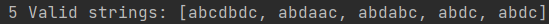
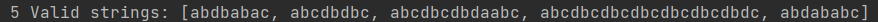
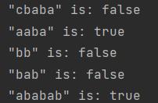
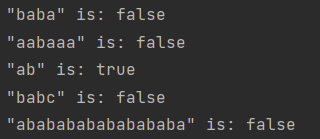

# Intro to formal languages. Regular grammars. Finite Automata.

### Course: Formal Languages & Finite Automata
### Author: Braguta Adelia

----

## Theory
This topic is related to two important concepts in computer science: formal languages and automata theory.

A formal language is a set of strings that are formed from a finite set of symbols, which can be either a set of characters (i.e., an alphabet) or other objects. Formal languages can be classified according to their generative grammar, which is a set of rules for generating all the valid strings in the language. Context-free grammars (CFGs) are a type of grammar that can generate a wide variety of languages, and they are particularly important in the context of programming languages.

An automaton is a mathematical model that can recognize a language. An automaton has a finite set of states, and transitions between those states that are labeled with input symbols. An input string is accepted by the automaton if it can traverse the sequence of transitions from the initial state to an accepting state.

The connection between formal languages and automata is that every regular language (a type of formal language) can be recognized by a finite automaton, and every context-free language (another type of formal language) can be recognized by a pushdown automaton (a type of automaton that has a stack for storing symbols).

There are many types of automata, each with their own strengths and limitations. Finite automata (also known as deterministic finite automata or DFAs) are a type of automaton that can recognize regular languages. They are particularly useful for simple pattern-matching tasks, such as recognizing whether a given string contains a particular sequence of characters.


## Objectives:

* Understand what a language is and what it needs to have in order to be considered a formal one.

* Provide the initial setup for the evolving project that you will work on during this semester. I said project because usually at lab works, I encourage/impose students to treat all the labs like stages of development of a whole project. Basically you need to do the following:

    * Create a local && remote repository of a VCS hosting service (let us all use Github to avoid unnecessary headaches);

    * Choose a programming language, and my suggestion would be to choose one that supports all the main paradigms;

    * Create a separate folder where you will be keeping the report. This semester I wish I won't see reports alongside source code files, fingers crossed;

* According to your variant number (by universal convention it is register ID), get the grammar definition and do the following tasks:

    * Implement a type/class for your grammar;

    * Add one function that would generate 5 valid strings from the language expressed by your given grammar;

    * Implement some functionality that would convert and object of type Grammar to one of type Finite Automaton;

    * For the Finite Automaton, please add a method that checks if an input string can be obtained via the state transition from it;


## Implementation description

The generateString method is a recursive function that generates a random string from the provided grammar. The method takes a symbol as input and uses it to look up the possible productions for that symbol in the productions map.
If the symbol is a terminal symbol (i.e., belongs to VT), the function simply returns the symbol. Otherwise, the function chooses a random production from the list of possible productions for the symbol and splits the production into individual symbols. It then recursively calls itself for each symbol in the chosen production until it reaches a terminal symbol.
The function builds the generated string by concatenating the results of the recursive calls. Once it has recursively generated a string, it returns the string to the caller.

```
private String generateString(String symbol) {
        if (VT.contains(symbol)) {
            return symbol;
        }

        List<String> possibleProductions = productions.get(symbol);
        String chosenProduction = possibleProductions.get(new Random().nextInt(possibleProductions.size()));
        String[] productionSymbols = chosenProduction.split("");
        StringBuilder sb = new StringBuilder();
        for (String s : productionSymbols) {
            sb.append(generateString(s));
        }
        return sb.toString();
    }
```

The FiniteAutomaton class is a representation of a finite automaton, which consists of a set of states, a set of accepting states, a set of transitions between states, and an initial state. The accepts method checks whether a given input string is accepted by the finite automaton by simulating the transitions in the automaton for each character in the input string and checking if the final state is one of the accepting states. If any transition is not defined for a given state and input character, then the method returns false indicating that the input string is not accepted.

```
public boolean accepts(String input) {
        String currentState = initialState;
        for (char c : input.toCharArray()) {
            if (!transitions.get(currentState).containsKey(Character.toString(c))) {
                return false;
            }
            currentState = transitions.get(currentState).get(Character.toString(c));
        }
        return acceptingStates.contains(currentState);
    }
```

The main Class creates a Grammar object which takes in a set of non-terminal symbols (VN), a set of terminal symbols (VT), a map of productions (productions), and a start symbol ("S"). The generateValidStrings method is called on the Grammar object with the parameter 5 to generate a list of five valid strings. The output strings are then printed to the console.

Additionally, the code creates a FiniteAutomaton object using a set of states (states), a set of accepting states (acceptingStates), a map of transitions (transitions), and an initial state ("q0"). The accepts method of the FiniteAutomaton object is called for each of the five input strings to determine whether each string is accepted by the automaton. The results of each test are then printed to the console.

## Results

Generated strings from the grammar provided:





Checked inputted strings:





## Conclusion

In conclusion, the study of formal languages is an important field in computer science, and has numerous practical applications. Regular grammars and finite automata are fundamental concepts in this field, and are used extensively in the design and analysis of programming languages, compilers, and other software systems. Regular grammars are used to define regular expressions, which are powerful tools for pattern matching and text processing. Finite automata provide a formal representation of systems with discrete states and transitions, and are used to model a wide range of systems and processes. Understanding these concepts and their relationship is key to developing a solid foundation in formal language theory and their applications in computer science.

## References

[Guide](https://else.fcim.utm.md/pluginfile.php/110458/mod_resource/content/0/LFPC_Guide.pdf)