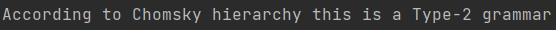
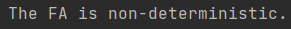
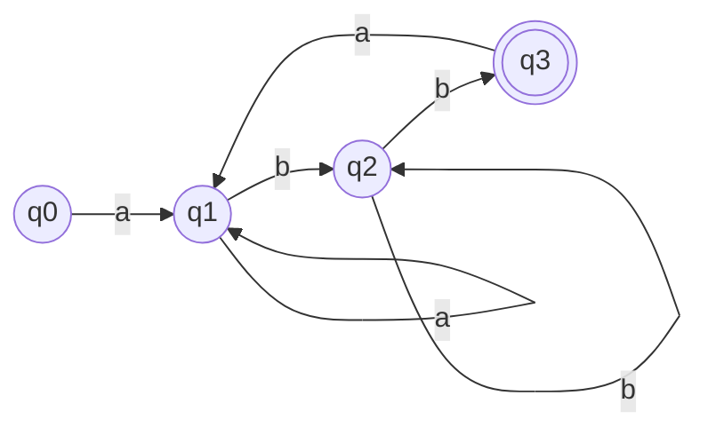

# Determinism in Finite Automata. Conversion from NDFA 2 DFA. Chomsky Hierarchy.

### Course: Formal Languages & Finite Automata
### Author: Braguta Adelia

----

## Theory
Determinism in Finite Automata:
In computer science and mathematics, a finite automaton (FA) or finite state machine (FSM) is a mathematical model of computation. A finite automaton is a set of states, an input alphabet, a transition function, and a start state and one or more final states. In a deterministic finite automaton (DFA), for each state and input symbol, there is exactly one next state. Determinism is an essential property of finite automata, as it ensures that the automaton produces a unique output for a given input.

Conversion from NDFA to DFA:
An Nondeterministic Finite Automaton (NFA) is a finite automaton where multiple transitions are possible from a given state and input symbol. A DFA is a finite automaton that accepts or rejects an input string based on a unique computation. DFA is a more powerful machine than NFA, and every NFA can be converted into a DFA. The process of converting an NFA to a DFA is known as the subset construction. In the subset construction, we create a new DFA state for each set of NFA states that can be reached by following ε-moves and then transitions on input symbols. We then define the transitions between these states based on the input symbols.

Chomsky Hierarchy:
The Chomsky hierarchy is a classification of formal grammars, which are used to describe the syntax of formal languages. The hierarchy was proposed by linguist Noam Chomsky in the 1950s. It is divided into four types, each with increasing generative power:

Type-0 grammars (unrestricted grammars): These grammars generate all possible strings over the input alphabet. They are also known as phrase-structure grammars.

Type-1 grammars (context-sensitive grammars): These grammars generate all strings that can be formed by rewriting a given string of terminal symbols while respecting certain context-sensitive constraints.

Type-2 grammars (context-free grammars): These grammars generate all strings that can be formed by rewriting a given string of non-terminal symbols without regard to the context in which they appear.

Type-3 grammars (regular grammars): These grammars generate all strings that can be formed by rewriting a given string of non-terminal symbols in which each production rule has at most one non-terminal on the left-hand side and a single terminal or non-terminal on the right-hand side.

Each type of grammar corresponds to a type of automaton that can recognize the language generated by the grammar. Specifically, type-0 grammars are recognized by Turing machines, type-1 grammars are recognized by linear-bounded automata, type-2 grammars are recognized by pushdown automata, and type-3 grammars are recognized by finite automata.

## Objectives:

* Understand what an automaton is and what it can be used for.

* Continuing the work in the same repository and the same project, the following need to be added: 
  * a. Provide a function in your grammar type/class that could classify the grammar based on Chomsky hierarchy.
  * b. For this you can use the variant from the previous lab.

* According to your variant number (by universal convention it is register ID), get the finite automaton definition and do the following tasks:
  * a. Implement conversion of a finite automaton to a regular grammar.
  * b. Determine whether your FA is deterministic or non-deterministic.
  * c. Implement some functionality that would convert an NDFA to a DFA.
  * d. Represent the finite automaton graphically (Optional, and can be considered as a bonus point):
    * You can use external libraries, tools or APIs to generate the figures/diagrams.
    * Your program needs to gather and send the data about the automaton and the lib/tool/API return the visual representation.

## Implementation description

The classifyGrammar() method first checks if the grammar is Type-0, which is the most general type of grammar that can generate any language that can be recognized by a Turing machine. If the grammar contains a production with an empty left-hand side, it can generate the empty language, which is a Type-0 language. If the grammar is Type-0, the method returns "Type-0".

```
private boolean isType0() {
        for (String leftSymbol : productions.keySet()) {
            if (productions.get(leftSymbol).contains("")) {
                return true;
            }
        }
        return false;
    }
```

If the grammar is not Type-0, the method proceeds to check if it is Type-1, which corresponds to context-sensitive languages. A grammar is Type-1 if its productions are of the form αBβ -> αγβ, where α and β are strings of terminals and non-terminals, B is a non-terminal, and the length of γ must be greater than or equal to the length of B. If the grammar is Type-1, the method returns "Type-1".

``` 
private boolean isType1() {
        for (String leftSymbol : productions.keySet()) {
            for (String production : productions.get(leftSymbol)) {
                String[] sides = production.split(" ");
                if (sides.length == 1) {
                    continue; // Skip productions of the form A -> ε
                }
                String lhs = sides[0];
                String rhs = production.substring(lhs.length() + 1);
                if (lhs.length() <= rhs.length()) {
                    return true;
                }
            }
        }
        return false;
    }
```

If the grammar is not Type-1, the method proceeds to check if it is Type-2, which corresponds to context-free languages. A grammar is Type-2 if its productions are of the form A -> α, where A is a non-terminal and α is a string of terminals and non-terminals. If every production has a single non-terminal on the left-hand side, it is a Type-2 grammar. If the grammar is Type-2, the method returns "Type-2".

```
private boolean isType2() {
        // A grammar is Type-2 if its productions are of the form A -> α,
        // where A is a non-terminal and α is a string of terminals and non-terminals.
        // Therefore, if every production has a single non-terminal on the left-hand side, it is a Type-2 grammar.
        for (String leftSymbol : productions.keySet()) {
            for (String production : productions.get(leftSymbol)) {
                String[] sides = production.split(" ");
                if (sides.length == 1 && VN.contains(leftSymbol)) {
                    return true;
                }
            }
        }
        return false;
    }
```
If the grammar is not Type-0, Type-1, or Type-2, it must be Type-3, which corresponds to regular languages. If the grammar is Type-3, the method returns "Type-3".

---

Now we will look at the toRegularGrammar takes a non-deterministic finite automaton as input and generates a regular grammar that generates the same language as the NFA.

Here the code loops through each transition in the NFA (stored in the delta map) and adds a production for each transition. It creates a string for the production by concatenating the input symbol and the state it transitions to. It adds the production to the list of productions for the "from" state in the productions map. If the "from" state doesn't have any productions yet, it creates an empty list to store them. Finally, it adds the input symbol to the set of terminals.
```
    for (Pair<String, String> transition : delta.keySet()) {
        String fromState = transition.getFirst();
        String inputSymbol = transition.getSecond();
        String toState = delta.get(transition);

        String production = inputSymbol + " " + toState;

        if (!productions.containsKey(fromState)) {
            productions.put(fromState, new ArrayList<String>());
        }
        productions.get(fromState).add(production);

        VT.add(inputSymbol);
    }
```

This part loops through each final state in the NFA (stored in the F set) and adds an empty production to the list of productions for that state in the productions map. If the state doesn't have any productions yet, it creates an empty list to store them.

```
    for (String q : F) {
        if (!productions.containsKey(q)) {
            productions.put(q, new ArrayList<String>());
        }
        productions.get(q).add("");
    }

```

This code adds a new non-terminal for the start symbol to the productions map, and adds a production for the start symbol that starts with the initial state of the NFA (q0). It then creates and returns a new Grammar object with the VN, VT, productions, and startSymbol variables.

```
    productions.put(startSymbol, new ArrayList<String>());
    productions.get(startSymbol).add(q0);

    return new Grammar(VN, VT, productions, startSymbol);
}
```
---
Next we have the function that checks whether a given finite automaton (FA) is deterministic or not. It does this by iterating over each state and input symbol in the FA, and checking whether there is exactly one transition that can be taken from that state with that input symbol.
```
public boolean isDeterministic() {
    for (String q : Q) {
        for (String a : Sigma) {
            Set<String> nextStates = getNextStates(q, a);
            if (nextStates.size() != 1) {
                return false;
            }
        }
    }
    return true;
}
```
The isDeterministic method returns a boolean value, true if the FA is deterministic, and false otherwise.

For each state q and input symbol a, the getNextStates method is called to get the set of states that can be reached from q with input symbol a. If this set has a size different from 1, the FA is not deterministic and the method returns false.

If all state-input pairs have exactly one transition, the method returns true, indicating that the FA is deterministic.

Note that this implementation assumes that the FA is complete, i.e., for each state and input symbol there is at least one transition defined. If the FA is not complete, this method may return false even if the FA is actually deterministic.

---
The toDFA() method returns a new DFA object with the same language as the input NFA. The method creates a dfaStates map to store the new states in the DFA, a dfaDelta map to store the transitions between those states, a visited set to keep track of visited states, and dfaQ0 and dfaF variables for the initial and final states of the DFA, respectively.

The method starts by creating the initial state of the DFA as a set containing only the initial state of the NFA. It then adds this state to the dfaStates map and to a queue of states to be processed.

```
Queue<Set<String>> queue = new LinkedList<>();
        queue.add(initialState);

while (!queue.isEmpty()) {
Set<String> currentState = queue.poll();

            
            visited.add(currentState);

            String dfaStateName = dfaStates.get(currentState);
            for (String q : currentState) {
                if (F.contains(q)) {
                    dfaF.add(dfaStateName);
                    break;
                }
            }
```

The while loop then processes each state in the queue, creating new states in the DFA for each set of states that can be reached from the current state in the NFA. It does this by computing the set of next states for each input symbol, creating a new state in the DFA if necessary, and adding a transition to the dfaDelta map.

The visited set is used to avoid processing the same set of states multiple times, which could lead to an infinite loop. The dfaStates map is used to keep track of the name of each state in the DFA, which is generated using the getNextStateName() method.

The getNextStateName() method generates a unique name for each new state in the DFA, using a sequence of capital letters. The method takes an integer count as input, which represents the number of states already created in the DFA. It then computes the number of characters needed for the state name, and generates each character in turn using modular arithmetic.
```
private String getNextStateName(int count) {
        int numChars = 1;
        while (count > Math.pow(26, numChars)) {
            count -= Math.pow(26, numChars);
            numChars++;
        }
        StringBuilder sb = new StringBuilder();
        for (int i = 0; i < numChars; i++) {
            int digit = (count / (int) Math.pow(26, numChars - i - 1)) % 26;
            sb.append((char) ('A' + digit));
        }
        return sb.toString();
    }
```


Finally, the method creates a new DFA object with the dfaQ, Sigma, dfaDelta, dfaQ0, and dfaF variables, and returns it.

```
Set<String> dfaQ = new HashSet<>(dfaStates.values());
        return new DFA(dfaQ, Sigma, dfaDelta, dfaQ0, dfaF);
```

Note that this implementation assumes that the input NFA is complete, i.e., for each state and input symbol there is at least one transition defined. If the NFA is not complete, the getNextStates() method called in the loop may return an empty set of next states, which could lead to incorrect behavior.


## Results
1. Provide a function in your grammar type/class that could classify the grammar based on Chomsky hierarchy.
```
Variant 7:
VN={S, D, E, F, L},
VT={a, b, c, d},
P={
  S → aD
  D → bE
  E → cF
  F → dD
  E → dL
  L → aL
  L → bL
  L → c
}
```
Output:


---
2. Determine whether your FA is deterministic or non-deterministic
```
Variant 7
Q = {q0,q1,q2,q3},
∑ = {a,b},
F = {q3},
δ(q0,a) = q1,
δ(q1,b) = q2,
δ(q2,b) = q3,
δ(q3,a) = q1,
δ(q2,b) = q2, 
δ(q1,a) = q1.
```
output:



3. Represent the finite automaton graphically


## Conclusion

In conclusion, formal language theory is a branch of computer science and mathematics that deals with the study of formal languages and their properties. This includes the study of grammars, automata, and the relationships between them. The Chomsky hierarchy is a classification of formal grammars into four types based on the complexity of the languages they can generate. Regular grammars are the simplest type and correspond to regular languages, while context-free grammars correspond to context-free languages, context-sensitive grammars correspond to context-sensitive languages, and unrestricted grammars correspond to recursively enumerable languages.

The algorithms for converting between different types of automata and grammars are fundamental to many areas of computer science, including compilers, natural language processing, and artificial intelligence. Understanding the Chomsky hierarchy and the algorithms for automata and grammar conversions is essential for anyone working in these fields.
## References

[Guide](https://else.fcim.utm.md/pluginfile.php/110458/mod_resource/content/0/LFPC_Guide.pdf)