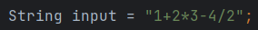
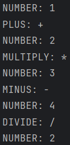
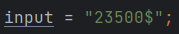
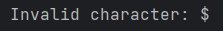

# Topic: Lexer & Scanner

### Course: Formal Languages & Finite Automata
### Author: Braguta Adelia, FAF-213

---

## Theory
In Computer Science, a lexer, short for "lexical analyzer", is a fundamental component of a compiler or interpreter that breaks down source
code into its individual lexical units, or "tokens". The lexer takes in the raw source code as input and generates a
stream of tokens that are subsequently consumed by the parser.

The tokens produced by the lexer are usually defined by a formal grammar or regular expressions that describe the syntax
of the programming language being analyzed. Some examples of tokens include keywords (e.g. "if", "else", "while"),
identifiers (e.g. variable and function names), literals (e.g. numeric and string literals), and punctuation symbols
(e.g. parentheses, semicolons).

The process of lexical analysis typically involves scanning the input source code character by character, identifying
and categorizing each character into its corresponding token. The lexer uses a state machine to keep track of its
current position in the input stream and its current mode or state, depending on the context of the code being analyzed.

---

## Objective:
* Understand what lexical analysis  is.
* Get familiar with the inner workings of a lexer/scanner/tokenizer.
* Implement a sample lexer and show how it works.

---

## Implementation description

The method 'tokenize()' in the Lexer class returns a list of tokens, which represent the smallest units of meaning in the input string.

```
public List<Token> tokenize() throws Exception {
        List<Token> tokens = new ArrayList<>();

        while (currentPos < input.length()) {
            char currentChar = input.charAt(currentPos);

            if (Character.isDigit(currentChar)) {
                String number = "";
                while (currentPos < input.length() && Character.isDigit(input.charAt(currentPos))) {
                    number += input.charAt(currentPos++);
                }
                tokens.add(new Token(TokenType.NUMBER, number));
            } else if (currentChar == '+') {
                tokens.add(new Token(TokenType.PLUS, "+"));
                currentPos++;
            } else if (currentChar == '-') {
                tokens.add(new Token(TokenType.MINUS, "-"));
                currentPos++;
            } else if (currentChar == '*') {
                tokens.add(new Token(TokenType.MULTIPLY, "*"));
                currentPos++;
            } else if (currentChar == '/') {
                tokens.add(new Token(TokenType.DIVIDE, "/"));
                currentPos++;
            } else {
                throw new Exception("Invalid character: " + currentChar);
            }
        }

        return tokens;
    }
```

The method starts by initializing an empty list of tokens. It then enters a loop that processes each character in the input string.
For each character, the method checks whether it is a digit. If it is, the method reads all the consecutive digits and
creates a new token with the TokenType.NUMBER type and the concatenated string of digits as the token's value.
It then adds the new token to the list of tokens.

If the character is not a digit, the method checks whether it is one of the four arithmetic operators (+, -, *, /). If it is,
the method creates a new token with the corresponding TokenType and the character as its value. It then adds the new 
token to the list of tokens and moves the current position to the next character in the input string.

If the character is not a digit or an arithmetic operator, the method throws an exception with a message indicating that 
the character is invalid.

Once all the characters in the input string have been processed, the method returns the list of tokens.

---

This code defines an enumeration called TokenType which represents the different types of tokens that can be recognized
by the lexer.

```
    public enum TokenType {
        NUMBER,
        PLUS,
        MINUS,
        MULTIPLY,
        DIVIDE
    }
```

The TokenType enum has five possible values: NUMBER, PLUS, MINUS, MULTIPLY, and DIVIDE. These correspond to the different
types of tokens that the lexer can recognize, namely numbers and the four basic arithmetic operators.

By using an enum to define the different token types, the code provides a clear and concise way to refer to these types 
throughout the lexer implementation. Each token created in the lexer can be assigned a TokenType value from this enumeration,
making it easy to recognize and process the different types of tokens in the input.

---

This is an example usage of the Lexer class. The input string 1+2*3-4/2 is passed to the Lexer constructor to create a 
new Lexer object. Then, the tokenize() method is called on the Lexer object to tokenize the input string into a list of 
Token objects. If an exception is thrown during the tokenization process, the error message is printed to the console. 
Finally, the list of Token objects is printed to the console using a for loop to iterate over each token and call its 
toString() method.

```
    String input = "1+2*3-4/2";
        Lexer lexer = new Lexer(input);
        try {
            List<Token> tokens = lexer.tokenize();
            for (Token token : tokens) {
                System.out.println(token);
            }
        } catch (Exception e) {
            System.out.println(e.getMessage());
        }
```

---

## Results

Input: 



Output:



Input:



Output:



## Conclusion

In conclusion, I have learned that Lexers are a fundamental component of programming language analysis and have a 
significant impact on the efficiency and accuracy of code parsing. Through studying the implementation of Lexers,
I have gained a deeper understanding of how source code is transformed into meaningful structures, and how these
structures are used by compilers, interpreters, and other programming tools to build and execute programs.

I have learned that Lexers operate by breaking down input text or source code into a series of tokens, which represent
the smallest units of meaning in the language. These tokens are then used by parsers to build more complex structures,
such as parse trees and abstract syntax trees, which provide a deeper understanding of the structure and meaning of the code.

Furthermore, I have discovered that the implementation of a Lexer requires careful consideration of the syntax and
semantics of the programming language being analyzed, as well as the specific requirements of the application or tool
being developed. By utilizing best practices and design patterns, such as regular expressions and state machines,
developers can create efficient and accurate Lexers that can handle a wide range of input types and formats.

## References

[A sample of a lexer implementation](https://llvm.org/docs/tutorial/MyFirstLanguageFrontend/LangImpl01.html)

[Introduction of Lexical Analysis](https://www.geeksforgeeks.org/introduction-of-lexical-analysis/)