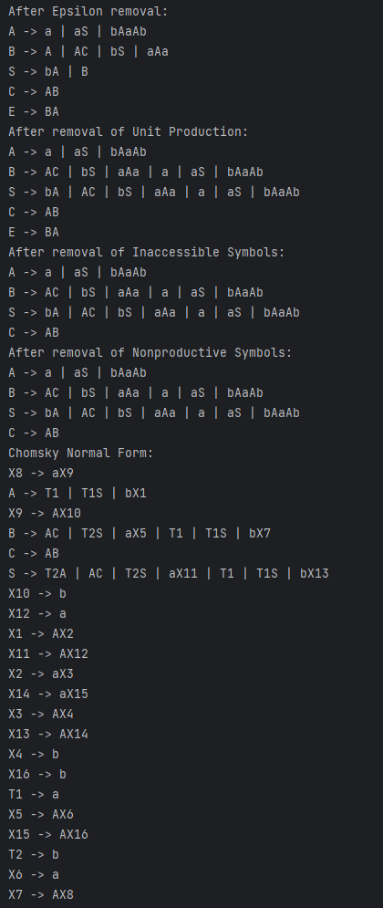
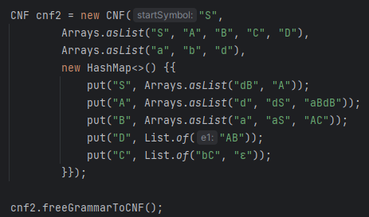

# Topic: Chomsky Normal Form

### Course: Formal Languages & Finite Automata
### Author: Braguta Adelia, FAF-213

---

## Theory

Chomsky Normal Form (CNF) is a standard form for context-free grammars in formal language theory. It is named after the 
renowned linguist Noam Chomsky, who introduced this concept in his seminal work in the 1950s.

In CNF, a context-free grammar is represented in a specific form, where every production rule is of the form A → BC or
A → a, where A, B, and C are nonterminal symbols and a is a terminal symbol. The symbol S is usually reserved for the 
start symbol of the grammar.

The CNF has some interesting properties that make it useful for various applications. For example, every context-free 
language can be generated by a grammar in CNF, and this representation has some nice algorithmic properties that make
certain problems easier to solve. Furthermore, parsing algorithms such as the CYK algorithm can efficiently handle 
context-free grammars in CNF.

To convert a context-free grammar to CNF, one can use a set of well-known transformations on the grammar. These
transformations essentially break down long production rules into simpler ones, and introduce new nonterminals as
necessary. The resulting grammar is guaranteed to be in CNF.

---

## Objective:

1. Learn about Chomsky Normal Form (CNF).
2. Get familiar with the approaches of normalizing a grammar.
3. Implement a method for normalizing an input grammar by the rules of CNF.
    1. The implementation needs to be encapsulated in a method with an appropriate signature (also ideally in an appropriate class/type).
    2. The implemented functionality needs executed and tested.
    3. A BONUS point will be given for the student who will have unit tests that validate the functionality of the project.
    4. Also, another BONUS point would be given if the student will make the aforementioned function to accept any grammar, not only the one from the student's variant.

---

## Implementation description

The function `eliminateEpsilon()` eliminates epsilon productions from a context-free grammar. Epsilon productions are productions that produce
the empty string. Eliminating epsilon productions is a step in converting a context-free grammar into Chomsky Normal Form.

The function first identifies all nullable variables, i.e. variables that can produce the empty string. It does this by
iterating over the productions map and checking if any of the productions contain the empty string "ε".

```
Set<String> nullables = new HashSet<>();
for (Map.Entry<String, List<String>> entry : productions.entrySet()) {
    if (entry.getValue().contains("ε")) {
        nullables.add(entry.getKey());
    }
}
```

The function then creates a new map to store the updated productions. For each production in the original map, the 
function creates a new list of productions that do not contain the empty string. If a production contains a nullable
variable, the function creates a new production for each possible combination of removing the nullable variable from
the production. Finally, any empty productions are removed.

```
Map<String, List<String>> newProductions = new HashMap<>();
for (Map.Entry<String, List<String>> entry : productions.entrySet()) {
    String variable = entry.getKey();
    List<String> oldProductions = entry.getValue();
    List<String> newProductionsList = new ArrayList<>();

    for (String production : oldProductions) {
        if (!production.equals("ε")) {
            boolean addProduction = true;
            for (String nullable : nullables) {
                if (production.contains(nullable.toString())) {
                    String newProduction = production.replace(nullable.toString(), "");
                    if (!newProductionsList.contains(newProduction)) {
                        newProductionsList.add(newProduction);
                    }
                }
            }
            if (!newProductionsList.contains(production)) {
                newProductionsList.add(production);
            }
        }
    }

    Iterator<String> iterator = newProductionsList.iterator();
    while (iterator.hasNext()) {
        String production = iterator.next();
        if (production.equals("")) {
            iterator.remove();
        }
    }

    newProductions.put(variable, newProductionsList);
}

```

Finally, the function updates the productions map with the new map that contains the updated productions.

```
productions = newProductions;
```

---

Up next, function `eliminateUnitProductions()` eliminates unit productions from the given grammar, i.e. productions of the 
form A -> B, where A and B are non-terminals.

The function iterates over all symbols (non-terminals) in the grammar and searches for unit productions, which are 
stored in a list. Then, for each unit production found, it replaces it by its productions (if any), and adds those 
productions to the list of productions for the original non-terminal symbol. This process continues until no more unit productions are found.

```
for (String symbol : this.productions.keySet()) {
    List<String> unit_productions = new ArrayList<>();
    for (String prod : this.productions.get(symbol)) {
        if (prod.length() == 1 && Character.isUpperCase(prod.charAt(0))) {
            unit_productions.add(prod);
        }
    }

    while (!unit_productions.isEmpty()) {
        // ...
    }
}

```

The first loop iterates over all non-terminals in the grammar. For each non-terminal, it initializes a list called unit_productions,
which will store all unit productions found for that symbol. The inner loop iterates over all productions of the current symbol,
and checks if each production is a unit production (i.e., has length 1 and the single character is an uppercase letter).
If a unit production is found, it is added to the unit_productions list.

```
while (!unit_productions.isEmpty()) {
    String unit = unit_productions.remove(0);
    this.productions.get(symbol).remove(unit);
    for (String prod : this.productions.get(unit)) {
        if (!this.productions.get(symbol).contains(prod)) {
            this.productions.get(symbol).add(prod);
        }
    }
    for (String prod : this.productions.get(symbol)) {
        if (prod.length() == 1 && Character.isUpperCase(prod.charAt(0))) {
            unit_productions.add(prod);
        }
    }
}

```

This is the main loop that eliminates unit productions. It continues until there are no more unit productions left in the 
unit_productions list. Inside the loop, it takes the first unit production from the list (remove(0)), removes it from the
list of productions for the current symbol, and adds its productions to the same list if they are not already present. 
Then, it looks for new unit productions in the list of productions for the current symbol, and adds them to the unit_productions list.

---

For the next function `eliminateInaccessibleSymbols()`, it removes eliminateInaccessibleSymbols(). The function starts by
creating a visited set to keep track of all symbols that are visited during the search for reachable symbols. 
Then it calls the visit() function with the start symbol and the visited set.

```
Set<String> visited = new HashSet<>();
visit(this.startSymbol, visited);
```

`visit()` is a recursive function that takes a symbol and the visited set. It adds the symbol to the set if it hasn't 
already been visited and then recursively calls visit() on all non-terminal symbols that appear in the symbol's productions.

```
private void visit(String symbol, Set<String> visited) {
        if (!visited.contains(symbol)) {
            visited.add(symbol);
            for (String prod : this.productions.get(symbol)) {
                for (int i = 0; i < prod.length(); i++) {
                    String s = prod.charAt(i) + "";
                    if (this.nonTerminal.contains(s)) {
                        visit(s, visited);
                    }
                }
            }
        }
    }
```

After the `visit()` function returns, the eliminateInaccessibleSymbols() function creates a new list of non-terminals 
(newNonTerminal) and a new map of productions (newProductions). It iterates over all non-terminals and adds them to the
new list and their corresponding productions to the new map if they appear in the visited set.

```
List<String> newNonTerminal = new ArrayList<>();
        Map<String, List<String>> newProductions = new HashMap<>();
        for (String nt : this.nonTerminal) {
            if (visited.contains(nt)) {
                newNonTerminal.add(nt);
                newProductions.put(nt, this.productions.get(nt));
            }
        }
```

Finally, the function sets the nonTerminal list and the productions map to the new lists and map.

```
this.nonTerminal = newNonTerminal;
this.productions = newProductions;
```

---

This class also implements a method called `eliminateNonproductive()` that eliminates nonproductive symbols from a set 
of productions in a context-free grammar. Nonproductive symbols are those that cannot be reached from the start symbol
using any sequence of productions.

The `eliminateNonproductive()` method begins by creating two sets, productive and oldProductive, which will be used to store
the productive symbols. The startSymbol is added to the productive set initially.

```
public void eliminateNonproductive() {
    Set<String> productive = new HashSet<>();
    productive.add(startSymbol);
    Set<String> oldProductive = new HashSet<>();

```

The while loop will execute until oldProductive and productive are equal. Within the loop, the method iterates over each
symbol and its corresponding production rule in the productions map. If the symbol is not in productive, it checks if all
the symbols in its corresponding production rule are either in productive or are terminals. If so, the symbol is added to productive.

```
    while (!oldProductive.equals(productive)) {
        oldProductive = new HashSet<>(productive);
        for (Map.Entry<String, List<String>> entry : productions.entrySet()) {
            String symbol = entry.getKey();
            List<String> rhs = entry.getValue();
            if (!productive.contains(symbol)) {
                for (String prod : rhs) {
                    boolean allInProductive = true;
                    for (char s : prod.toCharArray()) {
                        if (!productive.contains(String.valueOf(s)) && !terminals.contains(String.valueOf(s))) {
                            allInProductive = false;
                            break;
                        }
                    }
                    if (allInProductive) {
                        productive.add(symbol);
                        break;
                    }
                }
            }
        }
    }

```

The while loop will execute until oldProductive and productive are equal. Within the loop, the method iterates over each
symbol and its corresponding production rule in the productions map. If the symbol is not in productive, it checks if all
the symbols in its corresponding production rule are either in productive or are terminals. If so, the symbol is added to productive.

```
    Set<String> nonproductive = new HashSet<>(nonTerminal);
    nonproductive.removeAll(productive);

    for (String symbol : nonproductive) {
        productions.remove(symbol);
    }

```

Finally, the method iterates over the productions map once more and creates a new list of production rules for each symbol
that only includes symbols that are in productive or are terminals. It then replaces the original list of production rules with the new list.

```
    for (Map.Entry<String, List<String>> entry : productions.entrySet()) {
        String symbol = entry.getKey();
        List<String> rhs = entry.getValue();
        List<String> newRhs = new ArrayList<>();
        for (String prod : rhs) {
            boolean allInProductive = true;
            for (char s : prod.toCharArray()) {
                if (!productive.contains(String.valueOf(s)) && !terminals.contains(String.valueOf(s))) {
                    allInProductive = false;
                    break;
                }
            }
            if (allInProductive) {
                newRhs.add(prod);
            }
        }
        productions.put(symbol, newRhs);
    }

```

The method concludes by sorting the list of non-terminal symbols in productive and storing it back into the nonTerminal variable.

```
    List<String> productiveList = new ArrayList<>(productive);
    Collections.sort(productiveList);
    nonTerminal = productiveList;
}
```

---

Then in the end we have `toCNF()` that transforms the Free Grammar into Chomsky Normal Form.

First, The toCNF() method starts by initializing several variables that will be used throughout the method. The 
newProductions map will hold the new set of productions after converting the original grammar to Chomsky normal form 
(CNF). nextNewVarX and nextNewVarT are counters for creating new variables for the CNF productions. Finally, terminalVarMap
is a map that will store a mapping of each terminal symbol to a new variable that will be used in the CNF productions.

```
public void toCNF() {
    Map<String, List<String>> newProductions = new HashMap<>();
    int nextNewVarX = 1;
    int nextNewVarT = 1;
    Map<String, String> terminalVarMap = new HashMap<>();
```

This block of code performs the actual conversion of the original grammar to CNF. It does this by iterating through each
variable in the original grammar's productions, and then iterating through each production for that variable. If the 
production has length greater than or equal to 3, it is split into smaller productions that are in CNF. Specifically,
each consecutive pair of symbols in the production is replaced by a new variable. The new variables are added to prodVars
and are named X1, X2, etc

```
for (String var : productions.keySet()) {
    newProductions.put(var, new ArrayList<String>());

    for (String prod : productions.get(var)) {
        if (prod.length() >= 3) {
            List<String> prodVars = new ArrayList<>();
            for (int i = 0; i < prod.length() - 1; i++) {
                prodVars.add("X" + (nextNewVarX + i));
            }
            nextNewVarX += prod.length() - 1;
            nonTerminal.addAll(prodVars);

            newProductions.get(var).add(prod.charAt(0) + prodVars.get(0));
            for (int i = 0; i < prod.length() - 2; i++) {
                String newVar = prodVars.get(i);
                newProductions.putIfAbsent(newVar, new ArrayList<String>());
                newProductions.get(newVar).add(prod.charAt(i + 1) + prodVars.get(i + 1));
            }
            newProductions.putIfAbsent(prodVars.get(prodVars.size() - 1), new ArrayList<String>());
            newProductions.get(prodVars.get(prodVars.size() - 1)).add(prod.substring(prod.length() - 1));

        } else if (prod.length() == 2 && prod.chars().allMatch(c -> nonTerminal.contains("" + (char) c))) {
            newProductions.get(var).add(prod);

        } else {
            String newProd = prod;
            for (int i = 0; i < prod.length(); i++) {
                String sym = "" + prod.charAt(i);
                if (terminals.contains(sym)) {
                    if (!terminalVarMap.containsKey(sym)) {
                        String newVar = "T" + nextNewVarT;
                        nextNewVarT++;
                        nonTerminal.add(newVar);
                        newProductions.putIfAbsent(newVar, new ArrayList<String>());
                        newProductions.get(newVar).add(sym);
                        terminalVarMap.put(sym, newVar);
                    }
                    newProd = newProd.replaceFirst(sym, terminalVarMap.get(sym));
                }
            }
            newProductions.get(var).add(newProd);
        }
    }
}
```

---

## Results

**My Variant:**


**Main:**


**Output:**



***Here are some other variants to prove it works with other Grammars:***

**Variant 6:**


**Main:**


**Output:**


**Variant 5:**


**Main:**



**Output:**


## Unit Testing

***Here are the implementation of Unit Test for some methods from CNF Class:***

```
public class CNFTest {

    @Test
    public void testEliminateEpsilon() {
        CNF cnf = new CNF("S",
                Arrays.asList("S", "A", "B", "C"),
                Arrays.asList("a", "b"),
                new HashMap<>() {{
                    put("S", Arrays.asList("A", "B", "ε"));
                    put("A", Arrays.asList("aA", "b"));
                    put("B", Arrays.asList("AC", "bS", "aA"));
                    put("C", Arrays.asList("ε", "AB"));
                }});

        cnf.eliminateEpsilon();

        Map<String, List<String>> productions = cnf.getProductions();
        for (Map.Entry<String, List<String>> entry : productions.entrySet()) {
            String variable = entry.getKey();
            List<String> variableProductions = entry.getValue();
            for (String production : variableProductions) {
                assertFalse(production.contains("ε"));
            }
        }
    }

    @Test
    public void testEliminateInaccessibleSymbols() {
        CNF cnf = new CNF("S",
                Arrays.asList("S", "A", "B", "C"),
                Arrays.asList("a", "b"),
                new HashMap<>() {{
                    put("S", Arrays.asList("AB", "BA", "a"));
                    put("A", Arrays.asList("BC", "CB", "b"));
                    put("B", Arrays.asList("AB", "BA", "a"));
                    put("C", Arrays.asList("AC", "CA", "b"));
                }});

        cnf.eliminateInaccessibleSymbols();

        CNF expected = new CNF("S",
                Arrays.asList("S", "A", "B", "C"),
                Arrays.asList("a", "b"),
                new HashMap<>() {{
                    put("S", Arrays.asList("AB", "BA", "a"));
                    put("A", Arrays.asList("BC", "CB", "b"));
                    put("B", Arrays.asList("AB", "BA", "a"));
                    put("C", Arrays.asList("AC", "CA", "b"));
                }});

        assertEquals(expected.getStartSymbol(), cnf.getStartSymbol());
        assertEquals(expected.getNonTerminal(), cnf.getNonTerminal());
        assertEquals(expected.getTerminals(), cnf.getTerminals());
        assertEquals(expected.getProductions(), cnf.getProductions());
    }

    @Test
    public void testEliminateNonproductive() {
        CNF cnf = new CNF("S",
                Arrays.asList("S", "A", "B", "C", "D"),
                Arrays.asList("a", "b"),
                new HashMap<>() {{
                    put("S", Arrays.asList("A", "aB"));
                    put("A", Arrays.asList("aA", "bS"));
                    put("B", Arrays.asList("AC", "bS", "aA"));
                    put("C", Arrays.asList("ε", "AD"));
                    put("D", Arrays.asList("ε", "BC"));
                }});

        cnf.eliminateNonproductive();

        Map<String, List<String>> productions = cnf.getProductions();
        Set<String> nonproductive = new HashSet<>(Arrays.asList("D"));
        for (String symbol : nonproductive) {
            assertFalse(productions.containsKey(symbol));
        }
        for (Map.Entry<String, List<String>> entry : productions.entrySet()) {
            String variable = entry.getKey();
            List<String> variableProductions = entry.getValue();
            for (String production : variableProductions) {
                for (char s : production.toCharArray()) {
                    assertTrue(cnf.getNonTerminal().contains(String.valueOf(s)) || cnf.getTerminals().contains(String.valueOf(s)));
                }
            }
        }
    }
```

***And here are the results of the tests:***


## Conclusion

In conclusion, the Chomsky Normal Form (CNF) is a grammar form that is widely used in natural language processing and 
formal language theory. It has several benefits, such as simplifying parsing algorithms and facilitating grammar analysis.
By transforming a context-free grammar into CNF, we can eliminate the use of epsilon and unit productions, and ensure that
each production has exactly two symbols, one of which is always a non-terminal symbol.

Although the CNF conversion algorithm can be complex, it is an important tool for generating more efficient and accurate
parsers. By following the steps outlined in this tutorial and using the provided code examples, you can successfully 
transform your context-free grammar into CNF and take advantage of its many benefits.

## References 

[Chomsky Normal Form Wiki](https://en.wikipedia.org/wiki/Chomsky_normal_form)

[Converting Context Free Grammar to Chomsky Normal Form](https://www.geeksforgeeks.org/converting-context-free-grammar-chomsky-normal-form/)

[Guide from Else](https://else.fcim.utm.md/pluginfile.php/66784/mod_resource/content/1/LabN3exemplu_engl.pdf)